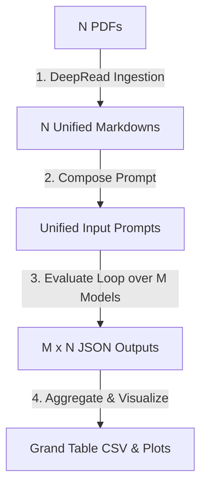

# jmllm: Multi-LLM Ontology-Constrained Evidence-Mapping Pipeline

A Python package and command-line tool for mapping heterogeneous scientific literature into structured, model-derived evidence spaces using a council of large language models.

---

## Associated Publication

This repository implements the ontology-constrained literature-synthesis pipeline described in:

> **Nejat, H., Maier, A., Spencer-Smith, J., Bastos, A.M. (2026).**  
> **"Ontology-constrained multi-LLM scoring of hypothesis support in the predictive processing literature."**  
> *arXiv:2606.05206 [q-bio.NC]*  
> [arXiv Listing](https://arxiv.org/abs/2606.05206) | [DOI: 10.48550/arXiv.2606.05206](https://doi.org/10.48550/arXiv.2606.05206)

---

## Core Features

- **Programmatic Python API**: Configure ontologies, register reasoning models, run literature evaluations, and generate consensus analytics programmatically.
- **DeepRead Multimodal Ingestion**: Figure-aware PDF text extraction that parses text and targets VLM-based figure descriptions.
- **HPC-36 Ontology**: Built-in 36-factor predictive coding hierarchy spanning Predictive Suppression (H1), Feedforward Error Propagation (H2), and Ubiquity (H3).
- **Consensus Analytics**: Pairwise Mean Square Distance (MSD) geometry, consensus averaging, and 3D scatter plots of hypothesis space support.

---

## Installation

Install the package in editable mode with development and visualization dependencies using `uv` or `pip`:

```bash
# Clone the repository
git clone https://github.com/HNXJ/mllm-public.git
cd mllm-public

# Setup virtual environment and install dependencies
uv pip install -e ".[dev,viz]"
# or using standard pip:
# pip install -e ".[dev,viz]"
```

---

## Full Pipeline Workflow (N PDFs, M Models)

The pipeline manages ingestion, evaluation, and consolidation across $N$ papers, $M$ models, a glossary $G$, and instructions/rules $R$:



### 1. Ingestion: Get Unified Markdowns from N PDFs
Extract interleaved text and VLM-generated visual descriptions from $N$ PDFs:
* Mapped and cached under `.cache/deepread/` using the MD5 checksum hash of each PDF.
* Output layout saved as `{pdf_name}-vllm-deepread.md` under `content/markdowns/`.
```bash
# Extract single paper layout manually
jmllm-deepread content/inputs/Bastos2012.pdf -o content/markdowns/Bastos2012-vllm-deepread.md
```

### 2. Prompt Prep: Make Unified Inputs (Prompts)
The pipeline automatically compiles the standard input prompt for each evaluation:
$$\text{Prompt} = \text{Instructions } (R) + \text{Glossary } (G) + \text{Unified Markdown } (M_{\text{doc}}) + \text{Output Template Placeholder}$$
* **Pre-run Context Limit Guard**: Checks the active model profile's context window. If the compiled prompt exceeds the limit (e.g., 128K), it calls `compress_prompt()` to selectively strip non-critical sections (like Methods/Discussion) and inject warning placeholders, preserving the Abstract, Results, and Ontology Glossary.

### 3. Model Loop: Run and Validate JSON Outputs
Iterate evaluations across $M$ models and $N$ papers:
* Launches concurrent evaluation threads using `ThreadPoolExecutor`.
* **JSON Extraction Resilience**: Uses nested curly brace count parsing to isolate the balanced JSON payload from the raw text completion.
* **Validation**: Validates the payload structure against the `HpcEvaluationResponse` schema (mapping unaddressed factors as `null`).
* Output JSON saved to `content/outputs/{pdf}_{model}_{glossary}_run1.json`.

### 4. Consolidation: Grand Table (CSV) & Visualizations
* **Grand Table Generation**: Pulls all outputs from `content/outputs/`, calculates statistical averages (means and standard deviations) for H1, H2, and H3, and writes the consolidated table to [content/tables/aggregated_scores.csv](content/tables/aggregated_scores.csv).
* **Consensus Visualizations**: Generates comparisons, heatmaps, and 3D projections from the Grand Table.
```bash
# Run manual aggregation script
.venv/bin/python -c "from pathlib import Path; from jmllm.util.helpers import aggregate_scores_from_json; df = aggregate_scores_from_json(Path('content/outputs')); df.to_csv('content/tables/aggregated_scores.csv', index=False)"

# Run plotting tool
jmllm-vis --csv_path content/tables/aggregated_scores.csv --reports_dir content/reports
```

---

## Programmatic Python API Usage

```python
import jmllm

# 1. Configure pathways & ontology templates
jmllm.set_instructions("ontology/instructions/hpc_eval_prompt.md")
jmllm.set_glossary("ontology/glossary/HPC/hpc-36-reference.md")
jmllm.set_path("content")  # Root folder containing inputs/, outputs/, tables/

# 2. Register models (updates profiles dynamically)
jmllm.add_model(
    name="gemma-4-e4b-it-mxfp8",
    url="http://localhost:1234",
    temperature=0.5,
    context_window=128000,
    top_p=0.9,
    min_p=0.1
)

# 3. Execute evaluation pipeline on inputs concurrently
jmllm.run(inputs=["Bastos2012.pdf", "RaoBallard1999.pdf"], parallel_workers=2)

# 4. Generate visual consensus reports
jmllm.visualize()
```

---

## Command Line Interface (CLI)

The package registers three command-line entry points upon installation:

### 1. Run Pipeline
Execute the full multi-LLM scoring pipeline:
```bash
jmllm-run \
  --pdfs_to_process Bastos2012 Bakhtiari2021 \
  --reasoning_model_names gemma-4-e4b-it-mxfp8 \
  --engine_url http://localhost:1234 \
  --temperature 0.5 \
  --top_p 0.9 \
  --min_p 0.1 \
  --context_window 131072 \
  --parallel_workers 2 \
  --timeout 300 \
  --no_load
```

### 2. Generate Visualizations
Generate heatmaps and 3D scatter projections from the aggregated scores CSV:
```bash
jmllm-vis \
  --csv_path content/tables/aggregated_scores.csv \
  --reports_dir content/reports
```

### 3. DeepRead PDF Extraction Only
Extract interleaved text and VLM-described figures from a PDF:
```bash
jmllm-deepread source_paper.pdf -o output_cached.md
```

---

## Repository Layout

```
├── ontology/           # Core ontologies (glossary/ & evaluation instructions/)
├── content/            # Runtime directories (inputs/, markdowns/, outputs/, tables/, reports/)
├── src/jmllm/          # Package source (pipeline namespaces, vis, and util)
├── tests/              # Unit and integration test suite
├── docs/               # In-depth manuscript mappings and tested environments
└── legacy/             # Refactored queue runner scripts and configs
```

---

## Documentation Index

For detailed explanations of configurations, compliance, and metrics, see:
- [Tested Environments](docs/TESTED_ENVIRONMENTS.md) — OS/Python/package versions.
- [Models & Runtime Specification](docs/MODELS_AND_RUNTIME.md) — Models specification and decoding parameters.
- [Reproducibility Guide](docs/REPRODUCIBILITY.md) — 7-stage pipeline explanation.
- [Nature Compliance Report](docs/NATURE_COMPLIANCE_REPORT.md) — checklist compliance.
